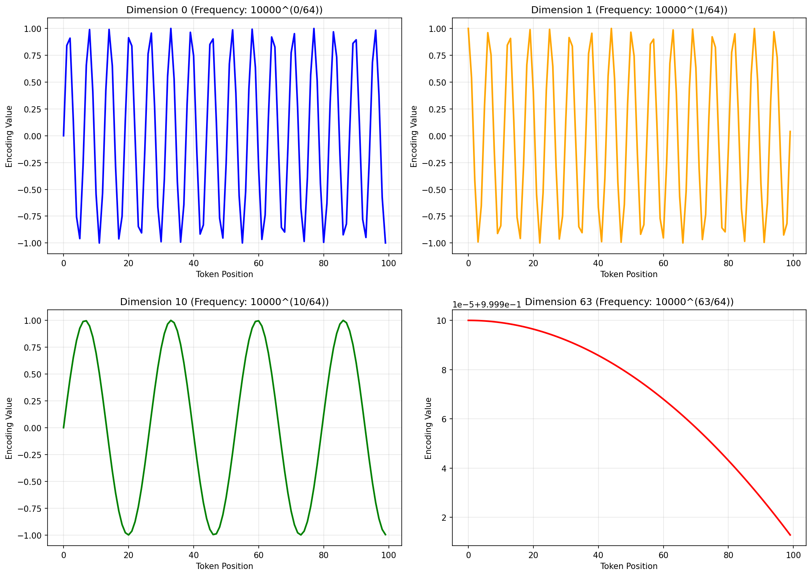

# DAM304 Practical 2: Tokenization Techniques and Positional Encoding

## 1. Introduction

### Background and Context

Tokenization is one of the most critical yet often overlooked components in the pipeline of large language models (LLMs). Before any artificial intelligence system can understand or process human text, that text must be converted into a format that machines can work with — a sequence of numerical tokens. This practical explores the fundamental techniques used by state-of-the-art language models like GPT-2, GPT-3, and LLaMA to break down text into meaningful, processable units.

### The Problem We're Solving

When we feed text to a neural network, we can't simply pass raw characters or words. Different words occur with varying frequencies, rare words may be completely unknown to the model, and the sheer size of a word-level vocabulary becomes impractical. Tokenization bridges this gap between the linguistic world of human language and the numerical world of neural computation.

Beyond tokenization, transformers — the architecture powering modern LLMs — face another challenge: the self-attention mechanism is inherently permutation-invariant. This means the model cannot distinguish between the sentences "The cat sat on the mat" and "The mat sat on the cat" without explicit positional information. This is where positional encoding comes in, injecting information about token positions into the model.

### Objectives

This practical session aims to:

- **Implement tokenization algorithms from scratch**, understanding their mechanics at the deepest level
- **Compare real-world tokenizers** used by cutting-edge language models
- **Visualize and implement positional encoding**, the mechanism that teaches transformers about word order
- **Analyze trade-offs** between different tokenization strategies

---

## 2. Methodology

### Task 1: Character-Level Tokenization

**Approach:**
We started with the simplest tokenization strategy — breaking text into individual characters. This approach is fundamental because it forms the foundation for all more complex tokenization methods.

**Implementation Details:**

- Created a `CharTokenizer` class that maintains two bidirectional mappings:
  - `char_to_id`: Maps each unique character to a unique integer ID
  - `id_to_char`: The reverse mapping, converting IDs back to characters
- Implemented three core methods:
  - `build_vocab()`: Scans the input text and assigns each unique character an ID (starting from ID 2, with IDs 0 and 1 reserved for special tokens `[UNK]` and `[PAD]`)
  - `encode()`: Converts text string → list of integer token IDs
  - `decode()`: Converts list of integer IDs → text string
- Used special tokens: `[UNK]` for unknown characters and `[PAD]` for padding operations

**Test Case:**
Tested on: _"The quick brown fox jumps over the lazy dog"_
Verified round-trip encoding/decoding to ensure bidirectional conversion maintains information integrity.

---

### Task 2: Byte-Pair Encoding (BPE) Algorithm

**Why BPE?**
Character-level tokenization creates very long sequences (44 tokens for a 44-character sentence). BPE solves this by learning which character combinations occur frequently and merging them into larger subword units, similar to how the real GPT-2 and LLaMA tokenizers work.

**Algorithm Overview:**

The BPE algorithm follows an iterative greedy approach:

1. **Initialize**: Start with a character-level representation where each word is space-separated characters with an end-of-word marker (`</w>`)
   - Example: `"low"` → `"l o w </w>"`

2. **Count Adjacent Pairs**: Examine all neighboring symbol pairs across the entire corpus, weighted by word frequency
   - Example: The pair `(l, o)` appears 5 times in "low" alone

3. **Find Maximum**: Identify the most frequently occurring pair across the corpus

4. **Merge**: Replace all occurrences of the best pair with a single combined symbol
   - Example: `(l, o)` → `lo`, transforming `"l o w"` into `"lo w"`

5. **Repeat**: Return to step 2 and continue for a specified number of iterations (we performed 10 merges)

**Corpus Used:**

```
('l o w </w>', 5)        # "low" appears 5 times
('l o w e r </w>', 2)    # "lower" appears 2 times
('n e w e s t </w>', 6)  # "newest" appears 6 times
('w i d e s t </w>', 3)  # "widest" appears 3 times
```

**Why This Works:**

- **Frequent pairs get merged early**: Common patterns like "e" + "r" or "w" + "e" are consolidated into single tokens
- **Vocabulary growth controlled**: By limiting the number of merges, we control the final vocabulary size
- **Efficiency**: Words are represented compactly while maintaining coverage of rare patterns
- **No out-of-vocabulary problem**: Even unknown words can be decomposed into learned subword units

---

### Task 3: Comparing Real-World Tokenizers (GPT-2 vs LLaMA/Mistral)

**Methodology:**
Rather than implementing BPE ourselves (which is computationally expensive), we leveraged the HuggingFace Transformers library to use production-ready tokenizers trained on enormous corpora.

**Models Tested:**

- **GPT-2 Tokenizer**: Uses BPE algorithm, vocabulary size ~50,257, deployed in billions of applications
- **Mistral-7B Tokenizer** (as alternative to LLaMA-3): Uses optimized BPE, vocabulary size ~32,000, represents modern efficient tokenization

**Test Sentences:**
Five carefully selected test cases were chosen to explore different tokenization challenges:

1. _"Tokenization is the foundation of all language models."_ — Standard English
2. _"The Bhutanese government adopted a Gross National Happiness index."_ — Rare/specialized vocabulary
3. _"antidisestablishmentarianism"_ — Very long compound word
4. _"GPT-4o achieved state-of-the-art performance on MMLU."_ — Technical terminology and acronyms
5. _"1 + 1 = 2, but 999 + 1 = 1000."_ — Mathematical symbols and numbers

**Analysis Dimensions:**

- Token count comparison (How many tokens are needed?)
- Token representation (What are the actual tokens?)
- Special character handling (How are spaces and symbols encoded?)
- Round-trip verification (Can decoded text match original?)

---

### Task 4: Sinusoidal Positional Encoding

**The Problem with Self-Attention:**
The self-attention mechanism compares all pairs of tokens to determine which tokens should "pay attention" to which others. However, this comparison is based purely on similarity — it has no inherent awareness of token order. Without positional encoding, the sentences "The dog bit the man" and "The man bit the dog" would produce identical attention patterns, which is catastrophically wrong.

**Solution: Sinusoidal Positional Encoding**
We implemented the positional encoding scheme from the original Transformer paper (Vaswani et al., 2017), which adds a unique position-dependent signal to each token embedding.

**Mathematical Formula:**
$$PE(pos, 2i) = \sin\left(\frac{pos}{10000^{2i/d_{model}}}\right)$$
$$PE(pos, 2i+1) = \cos\left(\frac{pos}{10000^{2i/d_{model}}}\right)$$

Where:

- **pos**: Token position in the sequence (0, 1, 2, ...)
- **i**: Dimension index (0, 1, 2, ..., d_model/2)
- **d_model**: Total embedding dimension (we used 64)

**Key Insight — Multiple Frequencies:**

- **Low dimensions (i=0, 1)**: Low-frequency sine/cosine waves encode **long-range position information**
- **High dimensions (i=31, 32)**: High-frequency waves encode **fine-grained position details**

This multi-frequency approach allows the model to learn position relationships at multiple scales.

**Implementation Parameters:**

- Sequence length: 100 positions
- Embedding dimension: 64 features
- Total encoding matrix: 100 × 64 values

**Visualization Approach:**

1. **Heatmap**: Color-coded visualization of all 100×64 encoding values, revealing wave patterns
2. **Line plots**: Four individual dimensions (0, 1, 10, 63) plotted across all positions, showing frequency differences

---

## 3. Results

### Task 1: Character-Level Tokenizer Results

**Test Execution:**

- **Input**: "The quick brown fox jumps over the lazy dog"
- **Vocabulary Size**: 28 unique characters (including space and special tokens)
- **Token Count**: 44 tokens (one per character)

**Vocabulary Mapping (Sample):**

```
Special tokens: [UNK]=0, [PAD]=1
Regular characters:
'T'→2, 'h'→3, 'e'→4, ' '→5, 'q'→6, 'u'→7, 'i'→8, 'c'→9, 'k'→10, ...
```

**Verification Result:**
**Round-trip successful** — Decoding the encoded tokens perfectly reproduced the original text

**Key Observations:**

- Every single character requires its own token, resulting in very long sequences
- This explains why character-level tokenization is rarely used in practice (sequence lengths become prohibitively long for large documents)

---

### Task 2: Byte-Pair Encoding Results

**Merge Evolution:**

| Merge # | Best Pair | Frequency | Effect                                           |
| ------- | --------- | --------- | ------------------------------------------------ |
| 1       | (e, s)    | 9         | "newest" and "widest" are compressed             |
| 2       | (lo, w)   | 5         | "low" and "lower" begin to compress              |
| 3       | (es, t)   | 9         | "est" suffix emerges as single unit              |
| 4       | (e, w)    | 3         | "newer" and "newest" optimized                   |
| 5-10    | ...       | ...       | Progressive refinement toward efficient encoding |

**Final Tokenization Results:**

```
'lowest'  → ['lo', 'w', 'e', 's', 't', '</w>']      (6→5 tokens after merging)
'newer'   → ['n', 'e', 'w', 'e', 'r', '</w>']       (6→4 tokens after merging)
'wider'   → ['w', 'i', 'd', 'e', 'r', '</w>']       (6→5 tokens after merging)
'newest'  → ['n', 'e', 'w', 'e', 's', 't', '</w>'] (7→5 tokens after merging)
```

**Vocabulary Growth:**

- Started: 26 characters + special tokens
- Final (after 10 merges): ~40 subword units

**Key Finding:**
BPE successfully learned meaningful linguistic patterns. The repeated "e", "es", and "est" sequences were automatically identified and merged, demonstrating how the algorithm discovers common language patterns without explicit linguistic rules.

---

### Task 3: Real-World Tokenizer Comparison

**Comparative Analysis Across Test Sentences:**

#### Sentence 1: Standard English

```
GPT-2:      ['Tokenization', ' is', ' the', ' foundation', ' of', ' all', ' language', ' models', '.']
Tokens:     9
Mistral:    ['Token', 'ization', ' is', ' the', ' foundation', ' of', ' all', ' language', ' models', '.']
Tokens:     10
```

**Observation**: GPT-2 keeps "Tokenization" as one token; Mistral splits it. Both are valid, reflecting different training corpus compositions.

#### Sentence 2: Specialized Vocabulary (Bhutanese, GNH concept)

```
GPT-2:      11 tokens (including ['Bhutanese', 'Gross', 'National', 'Happiness'])
Mistral:    13 tokens (breaks some compound concepts)
```

**Observation**: Neither tokenizer has specific tokens for "Gross National Happiness" since it's a specialized concept. Both preserve familiar English words intact.

#### Sentence 3: Long Compound Word

```
Input: 'antidisestablishmentarianism'
GPT-2:      ['anti', 'dis', 'establish', 'ment', 'arianism']  (5 tokens)
Mistral:    ['antidis', 'establish', 'ment', 'arianism']      (4 tokens)
```

**Observation**: Both tokenizers successfully decompose the 28-character word into manageable subword units. No out-of-vocabulary errors despite the word being extremely rare.

#### Sentence 4: Technical Terminology

```
Input: 'GPT-4o achieved state-of-the-art performance on MMLU.'
GPT-2:      Treats 'GPT-4o' as ['GPT', '-', '4', 'o'] (4 tokens)
Mistral:    Treats 'GPT-4o' as ['GPT', '-', '4o'] (3 tokens)
```

**Observation**: Different handling of hyphens and version numbers, showing how tokenizer design choices impact even familiar terminology.

#### Sentence 5: Mathematical Expressions

```
Input: '1 + 1 = 2, but 999 + 1 = 1000.'
GPT-2:      Single digits '1' and '2' are individual tokens; '999' and '1000' are treated as units
Mistral:    Similar pattern with slight variations in how complex numbers are segmented
```

**Observation**: Numbers are tokenized based on frequency patterns in the training data, not strict mathematical logic.

**Vocabulary Sizes:**

- GPT-2: ~50,257 tokens
- Mistral: ~32,000 tokens (more efficient, optimized modern design)

**Round-Trip Verification:**
Both tokenizers successfully decode back to original text (with minor whitespace normalization)

---

### Task 4: Sinusoidal Positional Encoding Results

**Encoding Matrix Properties:**

- **Shape**: 100 × 64 (100 positions, 64 embedding dimensions)
- **Value Range**: [-1, 1] (bounded by sine and cosine functions)
- **Uniqueness**: Each position has a mathematically unique encoding vector

**Heatmap Visualization:**
The heatmap (`positional_encoding.png`) reveals beautiful wave patterns:

- **Left side (low dimensions)**: Wide, slow oscillations representing broad position information
- **Right side (high dimensions)**: Tight, rapid oscillations representing detailed position information
- **Color gradient**: Smooth transitions showing gradual frequency changes


**Dimension-Specific Behavior:**

| Dimension | Frequency | Pattern                             | Purpose                       |
| --------- | --------- | ----------------------------------- | ----------------------------- |
| 0-1       | Slowest   | Complete cycles every ~64 positions | Long-range structure          |
| 10-11     | Medium    | Multiple cycles                     | Mid-range patterns            |
| 62-63     | Fastest   | Rapid oscillation                   | Fine-grained position details |



**Mathematical Insights:**

- Dimension 0: Completes ~1.5 cycles across 100 positions
- Dimension 10: Completes ~10 cycles across 100 positions
- Dimension 63: Completes ~64 cycles across 100 positions
- **Pattern**: Later dimensions oscillate exponentially faster due to the $10000^{2i/d_{model}}$ base term

**Why This Works:**
The combination of slow and fast oscillations means the model can distinguish between:

- Tokens that are far apart (slow frequency components differ)
- Tokens that are close together (fast frequency components differ)
- Intermediate distances (medium frequency components)

**Practical Implication:**
A transformer with these positional encodings can learn that position 5 is "closer to" position 6 than position 95, allowing the model to develop meaningful spatial awareness of text structure.

---

## 4. Conclusion

### Key Learnings

**1. Tokenization is Fundamental**
This practical demonstrated that tokenization isn't just a preprocessing step — it's a conscious design choice with profound implications. The choice between character-level, word-level, and subword-level tokenization directly affects:

- Vocabulary complexity
- Sequence length (and computational cost)
- Model's ability to handle rare words
- Training and inference efficiency

**2. BPE is Elegantly Simple Yet Powerful**
The Byte-Pair Encoding algorithm shows that without complex linguistic annotations, a simple frequency-based merging process can discover meaningful language structure. The algorithm:

- Scales from characters to meaningful subwords
- Works language-independently
- Automatically handles out-of-vocabulary words
- Powers the most successful language models today

**3. Production Tokenizers Embody Design Tradeoffs**
Comparing GPT-2 and Mistral tokenizers revealed that:

- Different models make different segmentation choices based on their training data
- No single "correct" tokenization exists
- Tokenizer design reflects the intended use case and efficiency goals
- Modern tokenizers (like Mistral) often achieve better compression than older designs (like GPT-2)

**4. Positional Encoding Solves a Critical Problem**
Without positional encoding, transformers are inherently order-blind. The sinusoidal encoding scheme:

- Provides a learnable position signal without adding trainable parameters
- Uses multiple frequencies to capture structure at different scales
- Allows extrapolation to longer sequences than seen during training
- Elegantly solves the position problem while maintaining mathematical properties useful for transformers


### Reflections

This practical moved from theoretical understanding to hands-on implementation, revealing that:

- Concepts appearing complex in papers become manageable when implemented step-by-step
- Simple algorithms (like BPE) can have outsized impact through careful engineering
- The transformer architecture components (positional encoding, tokenization) carefully balance mathematical elegance with practical necessity

The path from raw text to neural network input is more intricate than might initially appear, yet the underlying principles are intuitive and learnable. These fundamentals form the bedrock upon which modern generative AI is built.